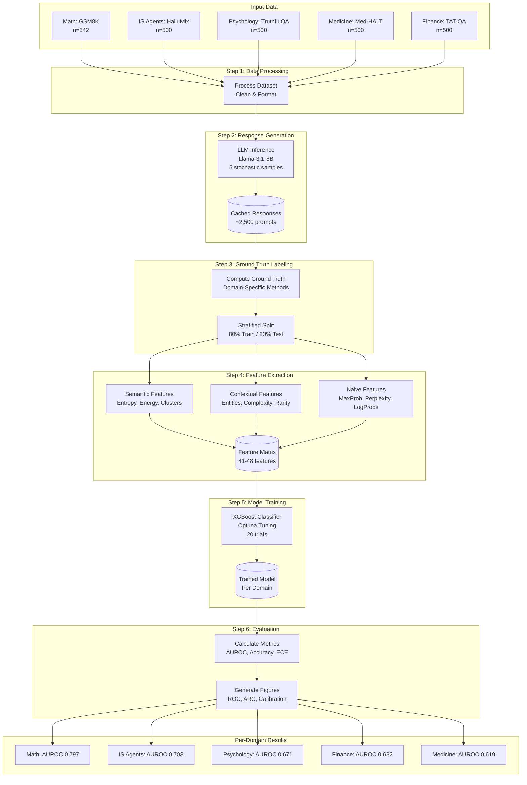
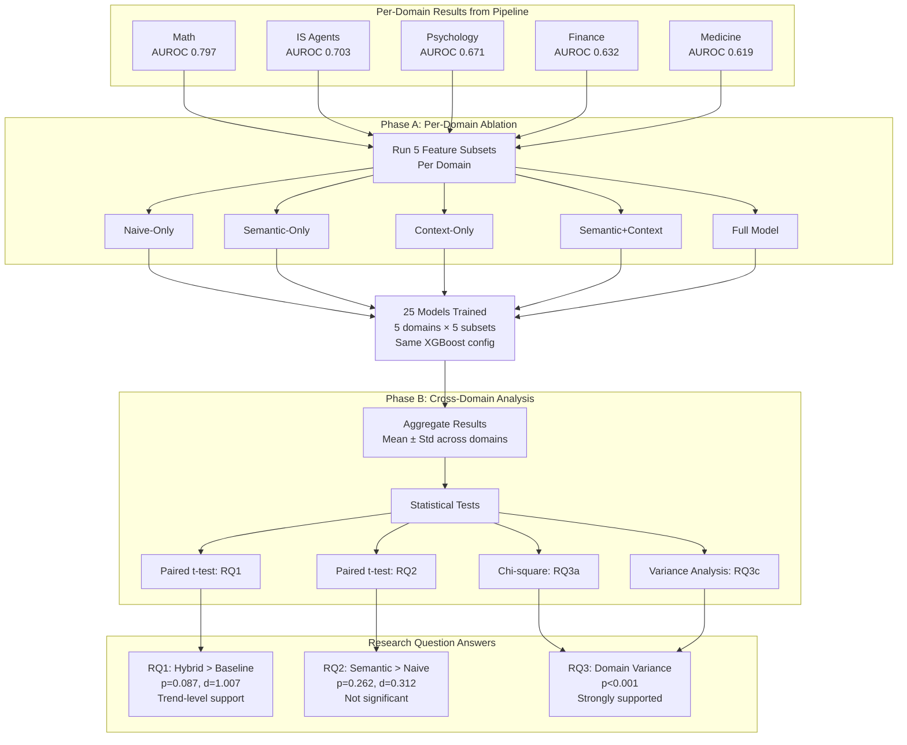
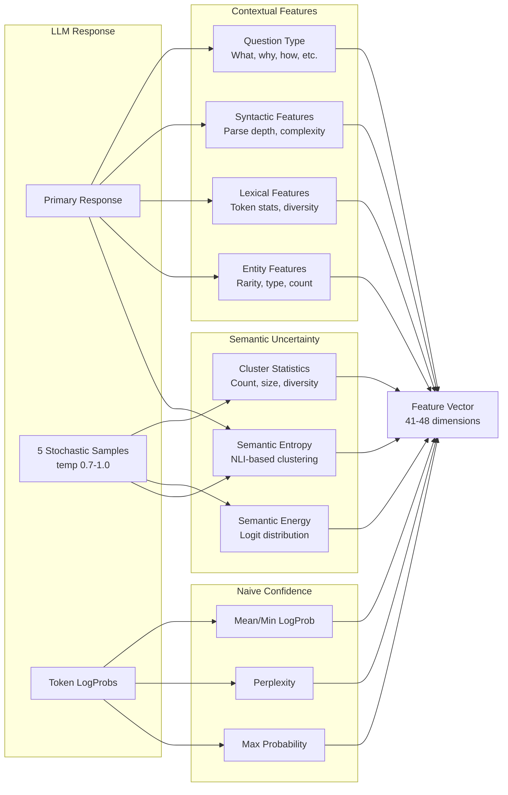
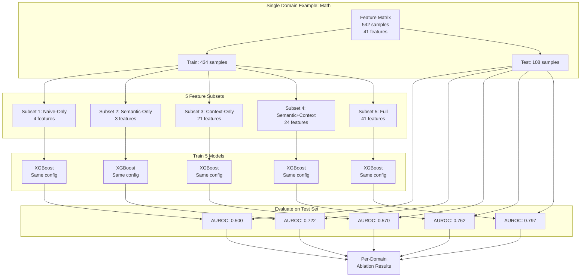
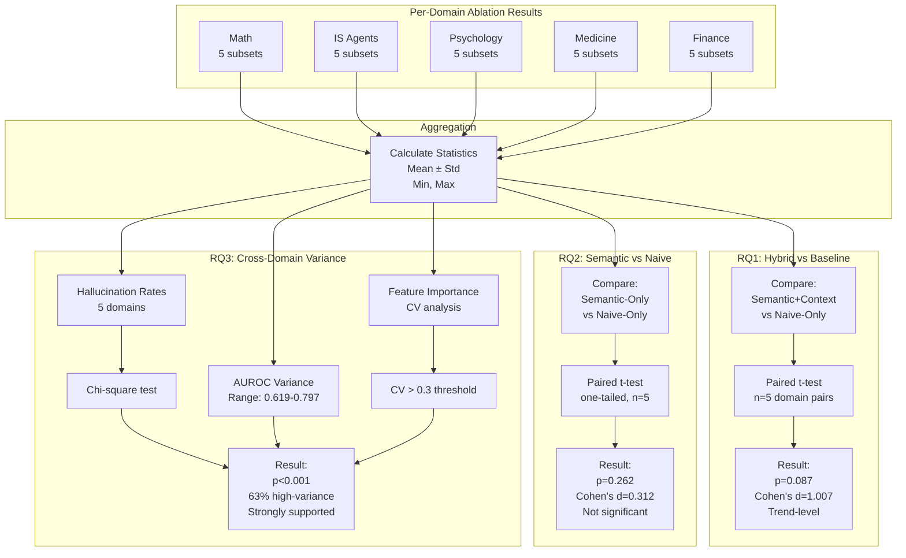
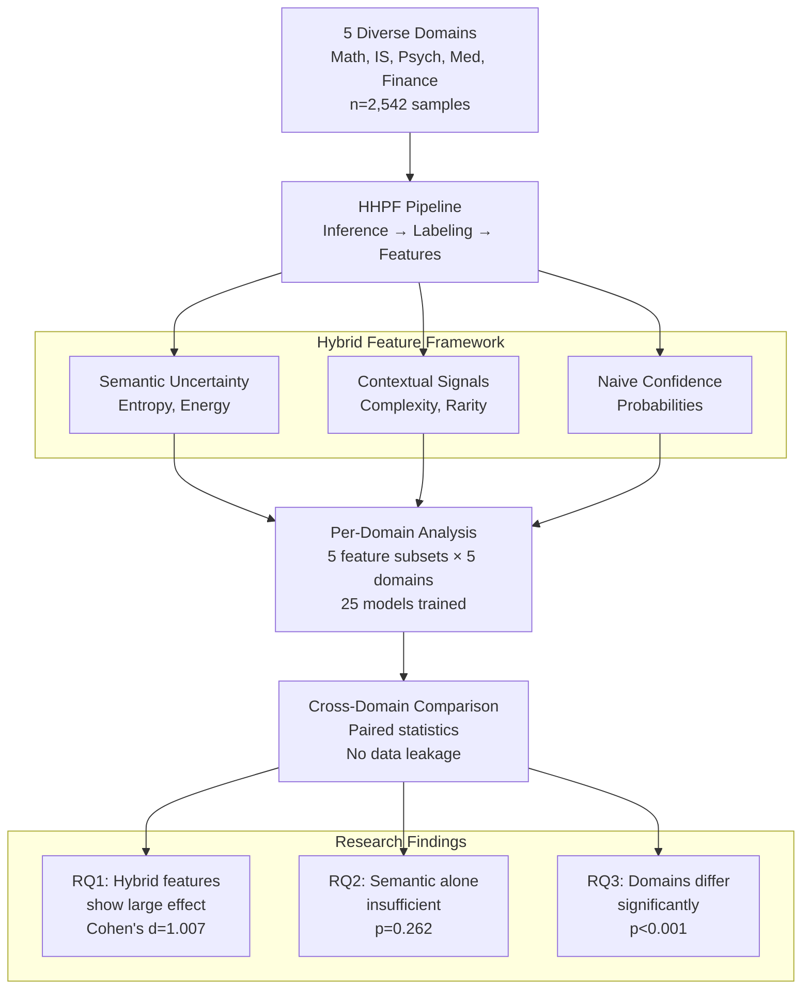
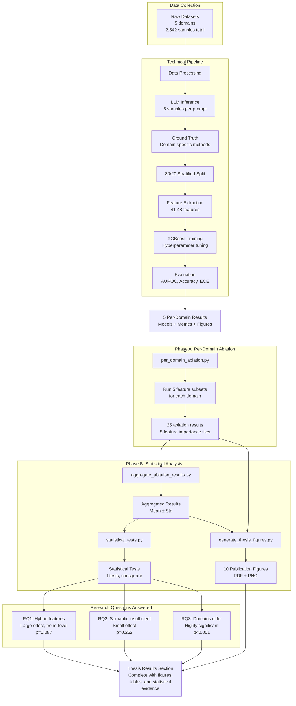
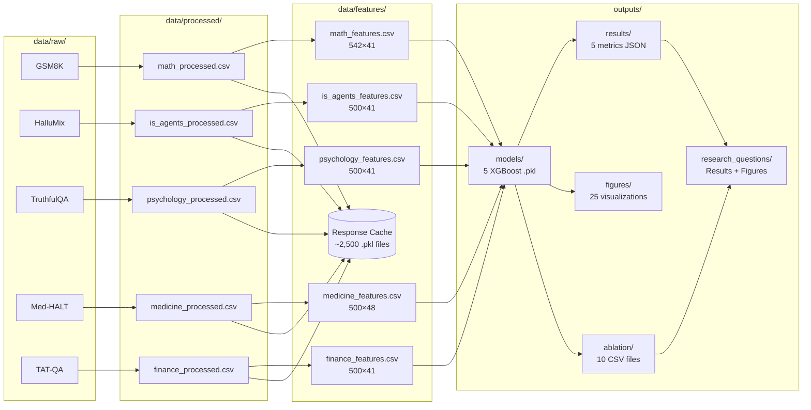

# HHPF Project Flow Diagrams

**Purpose:** Visual representation of the complete HHPF research workflow for thesis Results chapter  
**Date:** February 14, 2026  
**Status:** Thesis-ready diagrams

---

## Diagram 1: Complete HHPF Technical Pipeline

This diagram shows the complete technical execution pipeline from raw data to per-domain results.



**Key Points:**
- **5 diverse domains** enter the pipeline independently
- **Caching** at response and feature stages enables efficient reprocessing
- **3 feature categories** (semantic, contextual, naive) extracted for each sample
- **Per-domain training** ensures no cross-domain contamination
- **Each domain produces** independent model and metrics

---

## Diagram 2: Research Methodology Flow (Phase A → Phase B)

This diagram shows how per-domain results are analyzed to answer the three research questions.



**Key Points:**
- **No cross-domain training** - each domain analyzed independently in Phase A
- **5 feature subsets** tested per domain for fair comparison
- **Aggregation** in Phase B combines per-domain results statistically
- **Proper statistical tests** (paired t-tests, chi-square) answer research questions
- **Transparent reporting** of p-values and effect sizes

---

## Diagram 3: Feature Engineering Architecture

This diagram shows the three categories of features extracted from LLM responses.



**Key Points:**
- **Semantic features** require multiple stochastic samples for uncertainty quantification
- **Contextual features** analyze the question and response content
- **Naive features** use model's internal confidence signals
- **All features** combined into unified representation

---

## Diagram 4: Ablation Study Design

This diagram illustrates the per-domain ablation methodology used for RQ1 and RQ2.



**Key Points:**
- **Same train/test split** used for all feature subsets (fair comparison)
- **Identical XGBoost config** for all models (eliminates confounding)
- **5 independent models** trained per domain
- **Repeated for all 5 domains** = 25 total models

---

## Diagram 5: Cross-Domain Statistical Analysis

This diagram shows how per-domain ablation results are combined to answer research questions.



**Key Points:**
- **No cross-domain training** - results aggregated statistically, not by pooling data
- **Paired tests** for RQ1/RQ2 (within-domain comparisons across 5 domains)
- **Multiple analyses** for RQ3 (hallucination rates, AUROC variance, feature importance)
- **Transparent reporting** of p-values and effect sizes

---

## Diagram 6: High-Level Conceptual Overview

This simplified diagram provides a conceptual understanding of the complete research workflow.



**Key Message:** The HHPF framework uses hybrid features analyzed per-domain with cross-domain statistical comparison to reveal domain-dependent hallucination patterns.

---

## Diagram 7: Complete End-to-End Research Flow

This comprehensive diagram shows the entire research workflow from data collection to thesis conclusions.



**Complete Research Loop:**
1. Data Collection (5 domains, 2,542 samples)
2. Technical Pipeline (inference → features → training → evaluation)
3. Per-Domain Results (5 independent models)
4. Phase A: Per-Domain Ablation (25 models across feature subsets)
5. Phase B: Cross-Domain Analysis (statistical aggregation)
6. Research Questions Answered (with p-values and effect sizes)
7. Thesis-Ready Deliverables (figures, tables, documentation)

---

## Diagram 8: Data Flow Architecture

This diagram shows how data flows through the system and where results are stored.



**Storage Organization:**
- **`data/`** - Raw datasets, processed CSVs, feature matrices, response cache
- **`outputs/models/`** - Trained XGBoost models (one per domain)
- **`outputs/results/`** - Per-domain metrics JSON files
- **`outputs/figures/`** - Per-domain visualizations (ROC, ARC, calibration, etc.)
- **`outputs/ablation/`** - Ablation study results and feature importance
- **`outputs/research_questions/`** - Final RQ analysis, statistical tests, publication figures

---

## Usage Instructions for Thesis

### Including Diagrams in Results Chapter

**For LaTeX:**
1. Export diagrams as PDF or PNG (high resolution)
2. Include using `\includegraphics{figures/pipeline_complete.pdf}`
3. Add caption explaining the workflow

**For Word/Google Docs:**
1. Export diagrams as PNG (300 DPI)
2. Insert as inline images
3. Add figure caption below

**Recommended Placement:**

**Section 4.1 - Experimental Setup:**
- Use **Diagram 1** (Complete Pipeline) to show technical workflow
- Use **Diagram 3** (Feature Engineering) to explain feature extraction

**Section 4.2 - Analysis Methodology:**
- Use **Diagram 2** (Research Methodology) to show Phase A → Phase B
- Use **Diagram 4** (Ablation Design) to illustrate per-domain approach
- Use **Diagram 5** (Statistical Analysis) to show how RQ are answered

**Section 4.0 - Overview (Optional):**
- Use **Diagram 6** (Conceptual Overview) for high-level introduction

**Appendix - Technical Details:**
- Use **Diagram 8** (Data Flow) to document system architecture

### Exporting Diagrams

**Method 1: Mermaid Live Editor**
1. Copy mermaid code to https://mermaid.live
2. Export as PNG (300 DPI) or SVG
3. Convert SVG to PDF if needed

**Method 2: Cursor Preview**
1. View diagram in Cursor markdown preview
2. Take screenshot (high resolution)
3. Crop and save

**Method 3: Mermaid CLI (Recommended)**
```bash
# Install mermaid-cli
npm install -g @mermaid-js/mermaid-cli

# Export diagrams
mmdc -i docs/PIPELINE_DIAGRAMS.md -o outputs/research_questions/figures/pipeline_complete.png -w 2400
```

---

## Diagram Summary

| Diagram | Purpose | Best For | Complexity |
|---------|---------|----------|------------|
| 1. Complete Pipeline | Technical workflow | Methods/Results 4.1 | Medium |
| 2. Research Methodology | Phase A → Phase B | Results 4.2 | Medium |
| 3. Feature Engineering | Feature architecture | Methods | Low |
| 4. Ablation Design | Per-domain approach | Methods detail | Low |
| 5. Statistical Analysis | RQ answering process | Results 4.2 | Medium |
| 6. Conceptual Overview | High-level summary | Introduction/Overview | Low |
| 7. End-to-End Flow | Complete research loop | Appendix | High |
| 8. Data Flow | System architecture | Technical appendix | Medium |

**Recommended for Results Chapter:**
- **Must include:** Diagrams 1, 2, 5 (show complete story)
- **Optional but helpful:** Diagrams 3, 4 (explain details)
- **For appendix:** Diagrams 7, 8 (technical documentation)

---

## Key Messages Conveyed

1. **Rigorous Methodology:** Per-domain analysis prevents data leakage
2. **Hybrid Approach:** Combines semantic, contextual, and naive features
3. **Statistical Rigor:** Proper paired tests with p-values and effect sizes
4. **Domain Dependency:** Hallucination patterns vary significantly (RQ3)
5. **Comprehensive Analysis:** 30 models trained, 10 figures generated

---

**Diagrams Created:** February 14, 2026  
**Status:** Thesis-ready  
**Format:** Mermaid (can export to PNG/PDF/SVG)  
**Location:** `docs/PIPELINE_DIAGRAMS.md`
