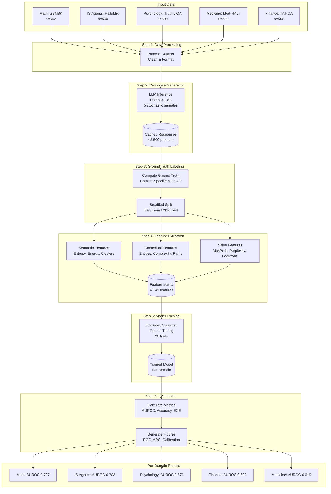

# Quick Export Instructions

**Goal:** Export 3 priority diagrams for thesis in ~15 minutes

---

## Step-by-Step Guide

### 1. Open Mermaid Live Editor

Go to: **https://mermaid.live**

### 2. Export Diagram 1: Complete Pipeline

**Source:** Open `docs/PIPELINE_DIAGRAMS.md` and find **Diagram 1: Complete HHPF Technical Pipeline**

**Copy this code block:**

**Export:**
1. Paste into Mermaid Live
2. Click "Actions" → "Download PNG"
3. Save as `pipeline_complete.png` in this directory

---

### 3. Export Diagram 2: Research Methodology

**Source:** Find **Diagram 2: Research Methodology Flow** in `docs/PIPELINE_DIAGRAMS.md`

**Copy and paste the mermaid code, then:**
1. Export as PNG
2. Save as `methodology_flow.png`

---

### 4. Export Diagram 5: Statistical Analysis

**Source:** Find **Diagram 5: Cross-Domain Statistical Analysis** in `docs/PIPELINE_DIAGRAMS.md`

**Copy and paste the mermaid code, then:**
1. Export as PNG
2. Save as `statistical_analysis.png`

---

## Done!

You now have the 3 essential diagrams for your thesis Results chapter.

**Optional:** Export Diagrams 3, 4, 6, 7, 8 using the same process if needed.

---

## Alternative: Screenshot from Cursor

1. Open `docs/PIPELINE_DIAGRAMS.md` in Cursor
2. Click preview (diagrams render automatically)
3. Press `Cmd+Shift+4` (macOS) to screenshot
4. Drag to select diagram area
5. Save to this directory

---

**Estimated time:** 15-20 minutes for all 3 priority diagrams
